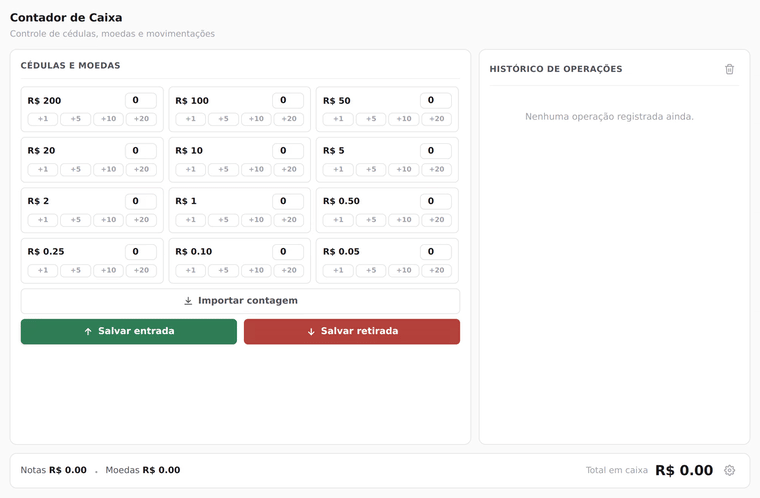
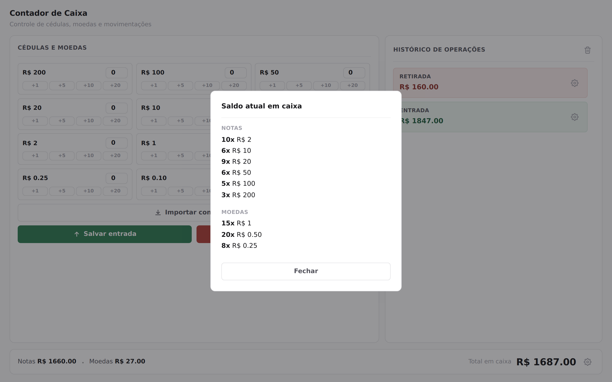
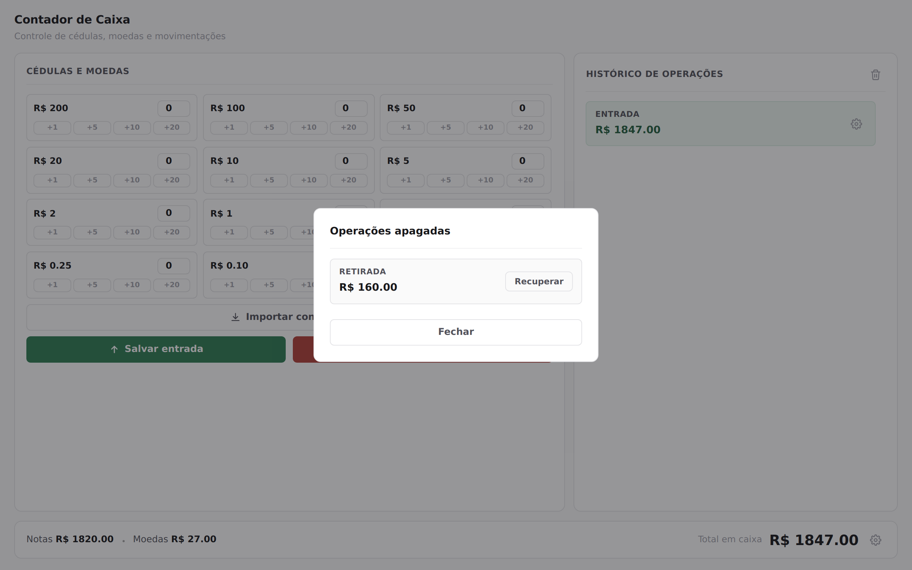

# Contador de Caixa

Ferramenta simples para conferência de caixa. Você conta as cédulas e moedas, registra se foi entrada ou retirada, e o sistema mantém o saldo e o histórico de tudo o que foi lançado.

Nasceu de uma necessidade prática: fechar caixa contando dinheiro físico, com histórico organizado, sem depender de planilha ou internet.


---

## Demonstração

Contando cédulas com os atalhos de quantidade, salvando uma entrada, depois uma retirada, e abrindo o detalhamento de uma operação no histórico:



Se preferir o vídeo em melhor qualidade, o arquivo está em [`media/demo.mp4`](media/demo.mp4).

---

## Como usar

1. Abra o `index.html` em qualquer navegador. Não precisa instalar nada.
2. Informe a quantidade de cada nota e moeda, digitando no campo ou usando os atalhos `+1` `+5` `+10` `+20`.
3. Clique em **Salvar entrada** (dinheiro entrando no caixa) ou **Salvar retirada** (dinheiro saindo).
4. O histórico, à direita, registra cada lançamento. Clique no ícone de engrenagem em qualquer item para ver o detalhamento por cédula e moeda.
5. Se precisar conferir rapidamente quanto tem no caixa agora, clique no ícone de engrenagem ao lado do total, no rodapé.
6. Já tem uma contagem pronta anotada em outro lugar? Cole em **Importar contagem**, uma linha por denominação, no formato abaixo.

```
3x R$ 50.00
10x R$ 5.00
25x R$ 0.25
```

### Saldo detalhado

Clicando na engrenagem ao lado do total geral, dá pra ver exatamente quantas cédulas e moedas de cada valor compõem o saldo atual:



### Recuperando um lançamento apagado

Apagar uma operação não a remove de verdade. Ela vai para uma lixeira, acessível pelo ícone ao lado de "Histórico de operações", de onde pode ser restaurada a qualquer momento:



---

## Por que foi feito assim

**Sem backend, sem instalação, sem framework.** É só HTML, CSS e JavaScript puro, sem nenhuma dependência (a única coisa que vem de fora é a fonte Inter, do Google Fonts). Basta abrir o `index.html` em qualquer computador e já funciona. Para contar dinheiro e guardar um histórico durante o expediente, React, Vue ou qualquer ferramenta desse porte seria complexidade que o problema simplesmente não pede. Menos peças significam menos coisa pra quebrar.

**Atalhos de quantidade em vez de só digitar.** Na correria de um caixa, clicar é mais rápido e menos sujeito a erro do que digitar número em teclado numérico de celular. Contar 20 notas de R$10 é dois cliques em "+10", não quatro toques pra digitar "20".

**Importação por texto como atalho, não substituto.** Se a contagem já está anotada em algum lugar (bloco de notas, mensagem, planilha), colar um texto no formato `3x R$ 50.00` é mais rápido do que preencher tudo de novo campo a campo. Os dois jeitos convivem.

**Apagar não apaga de verdade.** Erro de digitação acontece. Em vez de simplesmente sumir com um lançamento, a operação apagada vai para uma lixeira, de onde pode ser recuperada, exatamente como a lixeira do sistema operacional. Nada se perde por descuido.

**Paleta quase toda em preto, branco e cinza.** Cor tem custo cognitivo: quanto mais cores na tela, mais o olho precisa decidir onde prestar atenção. Aqui, verde e vermelho aparecem só onde têm significado real (entrada e saída de dinheiro), então realmente chamam atenção quando importam.

---

## Estrutura do projeto

```
contador-de-caixa/
├── index.html    → estrutura da página
├── style.css     → aparência (cores, layout, responsividade)
├── script.js     → lógica: cálculos, histórico, modal, importação
└── media/        → screenshots e vídeo de demonstração
```

Os três arquivos de código são separados de propósito. Mesmo sendo um projeto pequeno, misturar estrutura, estilo e comportamento no mesmo arquivo dificulta manutenção mais adiante. Ao mesmo tempo, não há necessidade de complicar isso com um bundler ou processo de build; a separação em arquivos já resolve.

---

## Limitações conhecidas

- **Os dados existem só enquanto a aba está aberta.** Recarregar a página ou fechar o navegador reinicia tudo, inclusive o histórico e a lixeira de apagados.
- **Uso local, um caixa por vez.** Não há login, nem separação entre usuários ou dispositivos.
- **A importação de texto segue um formato fixo** (`Nx R$ valor`, uma denominação por linha). Textos em outros formatos não são reconhecidos.

## Próximos passos, se for evoluir

- Persistir os dados no navegador (`localStorage`) para sobreviver a um F5, ou um backend simples se precisar acessar de mais de um dispositivo.
- Exportar o histórico do dia em CSV ou PDF, para juntar ao fechamento de caixa.
- Filtro de histórico por data, já que hoje tudo fica em uma lista só, sem separação por dia.

Nada disso foi feito ainda porque a prioridade da primeira versão era ter algo funcional para contar caixa. O resto se adiciona conforme o uso real pedir.
